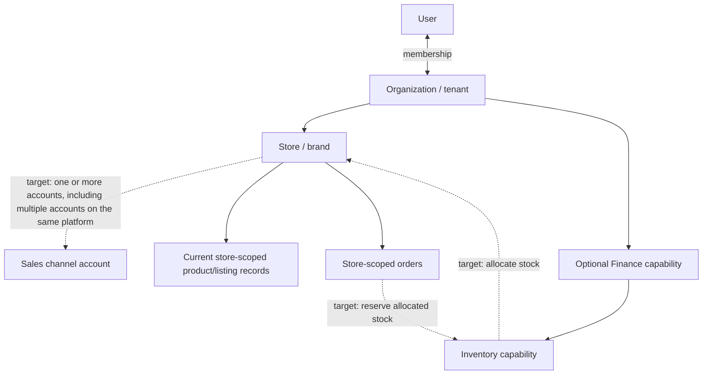

# Domain and Tenancy

This guide records the current persisted relationships and the intended tenant model. It does not define the future role/permission system or settle the product-catalog design.

## Status and scope

- **[CURRENT]** describes relationships observed in active models and request context.
- **[TARGET]** describes domain direction agreed in product discussion; it is not a claim that all supporting code exists.
- **[OPEN]** identifies a decision that still needs an explicit answer.

The application has two related scopes: an **Organization** is the tenant and consolidated business scope; a **Store** is a brand or sales operation inside that Organization. A Store's scope must always be checked against its Organization.

## Current persisted relationships

| Relationship or record | Current representation |
| --- | --- |
| User membership in Organization | Better Auth organization support and the `Member` model represent a `userId`–`organizationId` membership. The member schema currently has `owner` and `admin` role values. This does not establish that an application-wide roles-and-permissions policy is complete. |
| Organization invitations | The `Invitation` model includes `organizationId`, invitee email, inviter, and an optional role value. Its role field is not constrained to the same enum as `Member`, so do not infer a finalized role contract from these schemas. |
| Store belongs to Organization | `Store.organization` is a required reference to `Organization`. Store queries are constructed with the active organization context. |
| Product belongs to Organization and Store | Current product records require both `organization` and `store`, and include a `platform`. The current Product collection is store-scoped and platform-tagged; it is not an organization-wide master catalog. |
| Order belongs to Organization and Store | Current order records require `organization` and `store`, and include a `platform`. The platform value identifies the platform type; it does not identify a particular seller account on that platform. |
| Finance inventory | Inventory items, locations, mappings, movements, and reservations carry organization scope. A product/variant can map to an organization-scoped inventory item. Movements can include a Store dimension; reservations include Store and platform identifiers alongside order identifiers. The organization scope supports consolidated inventory and finance views; it does not mean every operational fact has no Store dimension. |

The application-owned business models generally call their tenant field `organization`; Better Auth-owned models use `organizationId`. Keep that distinction explicit when crossing between auth records and business records.

## Current tenant context and query scope

**[CURRENT]** `getTenantContext()` reads the signed-in session and returns its active organization, active store, and user identifiers. It resolves context; it does not by itself prove membership or authorize every resource operation. Repositories receive that context and commonly add organization and, where applicable, Store filters. The Mongoose multi-tenancy plugin requires an organization context for supported queries on schemas that declare the `organization` path.

Tenant isolation must not depend on a tenant ID supplied by the browser. Server code must establish that the session user is a member of the selected Organization, then authorize the requested action. When a Store or Store-owned resource is involved, also verify that the Store belongs to that same Organization. A database query hook or repository filter is defense in depth; neither substitutes for authorization or parent-child ownership checks.

The active Store is a working context, not the Organization boundary. Some valid operations (including consolidated Finance and inventory reads) are organization-scoped and may span Stores. Do not add a Store filter to an organization-scoped operation solely because a Store happens to be selected in the UI.

## Agreed target domain model

The intended product model is:

- **[TARGET]** A User may belong to multiple Organizations through memberships. A request operates in one selected active Organization at a time.
- **[TARGET]** An Organization may have multiple Stores/brands. A Store may have multiple sales channel accounts, including more than one account for the same platform.
- **[TARGET]** Finance is optional per Organization, and Inventory is part of Finance. Organization-level physical inventory supports consolidated operations; persistent allocation to a Store and temporary reservation for an Order are separate concepts.
- **[TARGET]** Assume one physical warehouse initially, while keeping a future multi-warehouse model possible.

The dashed relationships are target concepts, not claims about current database records. Current orders and products store a platform value, but the code inspected for this guide does not establish a general channel-account entity that distinguishes multiple accounts on one platform.

## Scope rules for new domain work

1. Resolve the Organization from authenticated server context and verified membership. Never accept a client-provided organization as proof of access.
2. If a request addresses a Store, verify that it belongs to the resolved Organization. Apply the same rule to resources that reference a Store.
3. Choose Organization or Store scope from the owning business concept and query needs. Organization scope enables consolidation; Store scope expresses operational ownership or filtering. Do not substitute one for the other for convenience.
4. Keep auth identifiers and application tenant fields distinct (`organizationId` for Better Auth-owned records; `organization` for application-owned domain records) unless a documented adapter maps them.
5. Do not treat a platform name as a channel-account identity. If a workflow needs to distinguish two Shopee accounts in one Store, the data model must carry an account identity explicitly.
6. Keep product catalog ownership separate from inventory ownership. An Organization-scoped inventory item or mapping does not by itself decide whether canonical product data is shared across Stores.

## Open questions

The canonical register contains the unresolved domain questions:

- [Q-001 — Product catalog ownership across Stores](../open-questions.md#q-001--product-catalog-ownership-across-stores)
- [Q-002 — Organization and Store role/permission scope](../open-questions.md#q-002--organization-and-store-rolepermission-scope)
- [Q-003 — Membership lifecycle and active tenant switching](../open-questions.md#q-003--membership-lifecycle-and-active-tenant-switching)
- [Q-009 — Shared Store pool versus per-account channel quotas](../open-questions.md#q-009--shared-store-pool-versus-per-account-channel-quotas)

Do not resolve these questions implicitly while adding an unrelated feature. Update this guide when a decision changes the domain contract.
