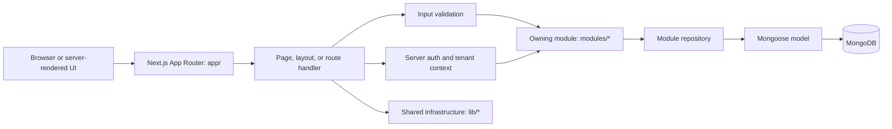

# System Architecture Overview

This document describes the repository's current architecture and separates it from the agreed future direction. A directory's existence does not by itself mean that its architecture is complete, consistently applied, or available as a runtime plugin.

## Product and application shape

**[CURRENT]** `airasap` is a seller-operations application for product and order workflows, financial operations and accounting, reports, store management, and marketplace file workflows. The application is implemented as one Next.js App Router codebase with MongoDB/Mongoose persistence: a **modular monolith**.

**[CURRENT]** The main runtime and data technologies are Next.js App Router, React, TypeScript, Better Auth, Zod, MongoDB, and Mongoose. `package.json` and `pnpm-lock.yaml` are the source of truth for package versions.

## Current request and data flow

The common dashboard API flow is shown below. It is the intended shape for new work, but existing code does not follow it uniformly.



For dashboard API work, the preferred request sequence is:

```text
route -> validation -> server auth/tenant context -> module use case -> repository -> model
```

Routes own HTTP concerns, input validation, and response mapping. The owning business module should own business rules. Shared infrastructure belongs in `lib/`; it should not become a second home for domain workflows. Server-rendered pages and legacy code do not all use this sequence today.

## Repository responsibilities

| Area | Current responsibility |
| --- | --- |
| `app/` | Next.js pages, layouts, route handlers, and route-local composition. The dashboard REST API is under `app/api/v1/dashboard/`. |
| `modules/` | Primary business-domain and application-service area. Current top-level directories include `accounts`, `files`, `finance`, `invitations`, `members`, `orders`, `organizations`, `products`, `reports`, `sessions`, `stores`, `tools`, `users`, and `verifications`. These directories do not all represent independently installable or equally isolated modules. |
| `lib/` | Shared infrastructure and utilities, including Better Auth setup, API helpers, tenant context, database connection, file handling, and spreadsheet parsing. |
| `components/` | Shared UI primitives and application UI. Keep business workflows in their owning modules rather than generic visual components. |
| `providers/`, `hooks/`, `constant/`, `types/` | Application-wide support. Keep these areas small and avoid moving domain workflows into them. |
| `public/` | Static assets. |

The `tools` area includes the marketplace profit-intelligence workflow. The codebase also has an older standalone `/api/profit-intelligence` API alongside the versioned dashboard API; its response conventions are not the template for new dashboard endpoints.

## Authentication, tenancy, and persistence

**[CURRENT]** Better Auth is configured in `lib/auth/auth.ts`, exposed through `app/api/auth/[...all]/route.ts`, and has a client configuration in `lib/auth/auth-client.ts`. The server-side `getTenantContext()` in `lib/api/tenant-context.ts` reads the signed-in session's active organization, active store, and user identifiers. This is the current context mechanism; authorization still needs to be checked for each operation.

**[CURRENT]** Domain persistence uses Mongoose models and the cached connection in `lib/db/connection.ts`. Model registration is imported there. Better Auth is configured with its MongoDB adapter in `lib/auth/auth.ts`, which currently creates a `MongoClient` directly. This is a current implementation detail to review alongside the separate Mongoose connection; it is not a recommendation to add another database connection.

Application data commonly carries an organization scope and may also carry a store scope. Some Finance data is intentionally organization-scoped for consolidated reporting and operations. Better Auth-owned records use the library's field contract. Tenant filters must come from trusted server context, not caller-supplied tenant identifiers.

## Current architectural seams

- **[CURRENT] Modular monolith, not a plugin host.** Business areas live in `modules/`, but module isolation is incomplete. For example, Orders currently imports Finance through `modules/orders/services/order-finance-integration.service.ts`. Treat this as an existing coupling to understand, not as a rule for new dependencies.
- **[CURRENT] Request patterns vary.** Some pages and handlers compose module repositories directly, and some endpoints do not use the preferred sequence in exactly the same way. Follow the relevant module's verified behavior and its guide; do not infer a universal abstraction from the folder structure.
- **[CURRENT] Multiple persistence entry points exist.** Mongoose owns the application connection while Better Auth configures a direct MongoDB client. Consolidation or lifecycle changes require a deliberate decision.
- **[CURRENT] Marketplace workflows are file-based.** Current spreadsheet import/parsing flows do not provide real-time marketplace stock synchronization or guarantee that channel inventory is accurate or that overselling is prevented.
- **[CURRENT] There is no general-purpose feature-flag service or dynamic third-party plugin framework.** Finance has its own access/entitlement code, but that does not establish a generic module-loading system.

## Agreed target direction

These points come from product discussion and must not be mistaken for proof that every related capability is already implemented:

- **[TARGET] Multi-organization domain.** A user may belong to multiple organizations. An organization may own multiple stores/brands, and a store may have multiple accounts on the same sales platform. Current session context selects an active organization and store.
- **[TARGET] Optional modules.** A module should be activatable per organization at runtime. Module entitlement/activation, gradual rollout flags, and user authorization are separate concerns.
- **[TARGET] Finance and Inventory.** Inventory is part of the optional Finance module. The inventory direction is organization-level physical stock, persistent logical allocation to stores, and temporary reservation for orders. Assume one warehouse initially while keeping a path open for multiple warehouses.
- **[TARGET] Future channel integrations.** Keep room for marketplace APIs and channel stock publication/reconciliation later. Until then, do not describe channel-level thresholds, reminders, synchronization, or oversell prevention as real-time or authoritative.

Detailed domain ownership, roles and permissions, inventory lifecycle, and module dependency rules belong in [Domain and Tenancy](./domain-and-tenancy.md), [Identity and Access Control](./identity-and-access-control.md), [Module Boundaries](./module-boundaries.md), [Optional Modules and Feature Flags](./optional-modules-and-flags.md), and [Inventory and Sales Channels](./inventory-and-channels.md). Unresolved decisions are indexed in the [Open Questions](../open-questions.md) register.

## Reading this overview

Use this page to orient yourself, then consult the guide for the specific domain or change. When this page and implementation disagree, inspect current source code and tests first. Update this overview when the major application boundaries or request flow change; put durable architectural choices and their rationale in `.agents/ADR/` after they have been decided.
